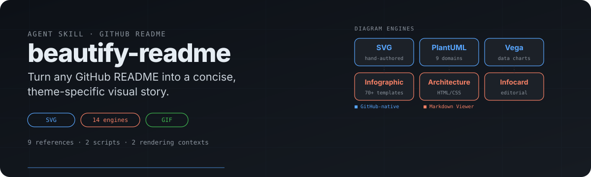

<p align="center">
  
</p>

# beautify-readme

An agent skill that turns any GitHub README into a concise, theme-specific visual story. It combines README content architecture, hand-authored SVG, 14 diagram engines across 5 rendering engines, and optional motion — supporting both GitHub-native rendering and Markdown Viewer enhanced diagrams.

## What it does

- **README mode** — restructure the story, build a visual system, and produce a cohesive homepage.
- **Asset-only mode** — create individual SVG heroes, section headers, diagrams, badges, or motion graphics without touching the README.
- **Dual rendering context** — GitHub-native SVG/PNG/GIF for `github.com`, plus code-fence diagrams (PlantUML, Vega, infographic, canvas, architecture, infocard) for Markdown Viewer extensions.

## Diagram engines

| Need | Engine | Code fence | Context |
| --- | --- | --- | --- |
| Software modeling (class, sequence, activity, state) | PlantUML | ` ```plantuml ` | Both |
| Cloud architecture (AWS, Azure, GCP, K8s) | PlantUML | ` ```plantuml ` | Both |
| Network / security / IoT / BPMN / ArchiMate | PlantUML | ` ```plantuml ` | Both |
| Data charts (bar, line, scatter, heatmap) | Vega-Lite | ` ```vega-lite ` | Both |
| Advanced charts (radar, word cloud) | Vega | ` ```vega ` | Both |
| KPI dashboard, timeline, SWOT, funnel | Infographic | ` ```infographic ` | Viewer |
| Concept map, knowledge graph | Canvas (JSON) | ` ```canvas ` | Viewer |
| Layered system architecture | Architecture | direct HTML | Viewer |
| Editorial information cards | Infocard | direct HTML | Viewer |

For GitHub-native context, generate the diagram with the engine, export a static SVG or PNG, and embed the image file. For Markdown Viewer context, write the code fence directly in the README.

## How it works

1. **Confirm the mode** — README redesign or asset-only.
2. **Confirm the rendering context** — GitHub-native or Markdown Viewer enhanced.
3. **Inspect the repository** — README, tree, metadata, screenshots, real outputs.
4. **Confirm visual implementation** — pure SVG or hybrid SVG + raster composition.
5. **Extract the project story** — audience, value, proof, first action, visual theme.
6. **Freeze a visual system** — palette, typography, shape, motif, composition.
7. **Build the visual layer** — SVG assets, code-fence diagrams, or hybrid composition.
8. **Preview and verify** — audit script, visual inspection, responsive check.
9. **Hand off safely** — show diff first; commit or push only when asked.

## Skill structure

```
skills/beautify-readme/
├── SKILL.md                          # Main skill: workflow, modes, quality bar
├── references/
│   ├── content-architecture.md       # README content sequencing and editing rules
│   ├── readme-canvas.md              # GitHub README canvas constraints
│   ├── svg-production.md             # Hand-authored SVG production rules
│   ├── visual-direction.md           # Theme-specific visual direction
│   ├── design-system.md              # Consolidated design rules (color, type, taste)
│   ├── project-native-hero.md        # Hero design from project content
│   ├── hybrid-svg-production.md      # Hybrid SVG + raster composition
│   ├── motion-production.md          # GitHub-safe GIF animation
│   └── diagram-engines.md            # 14-engine catalog with syntax rules
└── scripts/
    ├── audit_readme.py               # Audit README image references and SVG basics
    └── render_motion_gif.py          # Render GitHub-safe GIF from SVG + motion spec
```

## Installation

### Quick install

```bash
cp -r skills/beautify-readme ~/.qoder/skills/
```

### Manual

Copy the `skills/beautify-readme/` directory into your agent's skills folder:

| Agent | Path |
| --- | --- |
| Qoder | `~/.qoder/skills/` |
| Claude Code | `~/.claude/skills/` |
| Cursor | `~/.cursor/skills/` |

## Usage

```
Use $beautify-readme to redesign this repository homepage around its developer-tool theme.
```

```
Use $beautify-readme to create one SVG hero and three section headers without modifying the README.
```

```
Use $beautify-readme to add a PlantUML architecture diagram and a Vega-Lite benchmark chart to this README.
```

```
Use $beautify-readme to create a hybrid hero: SVG typography and layout, plus an ImageGen character cutout.
```

## Design philosophy

- The design looks native to the project, not to this skill.
- The hero's visual material comes from the project — not generic decoration.
- Real proof appears before abstract claims.
- The README becomes shorter or clearer, not merely more decorated.
- Removing the repository name should not make the hero reusable for an unrelated project.
- Every visual module has a communication job.
- Design choices pass a taste checklist: no centered-only heroes, no equal-width tiles, no pure black, no neon gradients, no AI filler phrasing.

## License

MIT
