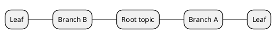

# Diagram engines

Structured diagram engines produce maintainable, semantically editable visuals that render inline in Markdown Viewer. For GitHub-native context, use the engine to generate the diagram, export a static SVG or PNG, and embed the image file. For Markdown Viewer enhanced context, write the code fence directly in the README.

## Table of contents

1. [Engine selection guide](#engine-selection-guide)
2. [PlantUML-based engines](#plantuml-based-engines)
3. [Vega / Vega-Lite](#vega--vega-lite)
4. [Infographic](#infographic)
5. [Canvas (JSON)](#canvas-json)
6. [Architecture (HTML/CSS)](#architecture-htmlcss)
7. [Infocard (HTML/CSS)](#infocard-htmlcss)
8. [Critical syntax rules summary](#critical-syntax-rules-summary)

---

## Engine selection guide

| Use case | Engine | Code fence |
| --- | --- | --- |
| Flowchart / process flow | PlantUML — activity diagram | ` ```plantuml ` |
| Sequence diagram | PlantUML — sequence | ` ```plantuml ` |
| State machine | PlantUML — statechart | ` ```plantuml ` |
| Class / object diagram | PlantUML — class | ` ```plantuml ` |
| Component / deployment | PlantUML — component | ` ```plantuml ` |
| Dependency graph | PlantUML — package | ` ```plantuml ` |
| Bar / line / scatter chart | Vega-Lite | ` ```vega-lite ` |
| Heatmap / multi-series | Vega-Lite | ` ```vega-lite ` |
| Radar / word cloud | Vega | ` ```vega ` |
| KPI dashboard / metrics | Infographic | ` ```infographic ` |
| Timeline / roadmap | Infographic | ` ```infographic ` |
| SWOT / comparison | Infographic | ` ```infographic ` |
| Knowledge summary card | Infocard | direct HTML |
| Data highlight / metrics card | Infocard | direct HTML |
| System layers (User→App→Data→Infra) | Architecture | direct HTML |
| Microservices architecture | Architecture | direct HTML |
| Mind map (hierarchical auto-layout) | PlantUML — mindmap | ` ```plantuml ` |
| Mind map (free-position) | Canvas | ` ```canvas ` |
| Knowledge graph | Canvas | ` ```canvas ` |
| AWS / Azure / GCP architecture | PlantUML — cloud | ` ```plantuml ` |
| Network topology | PlantUML — network | ` ```plantuml ` |
| Threat model / security | PlantUML — security | ` ```plantuml ` |
| Enterprise architecture (ArchiMate) | PlantUML — archimate | ` ```plantuml ` |
| BPMN workflow | PlantUML — bpmn | ` ```plantuml ` |
| ETL / data pipeline | PlantUML — data-analytics | ` ```plantuml ` |
| IoT / sensor network | PlantUML — iot | ` ```plantuml ` |

---

## PlantUML-based engines

All PlantUML-based skills share the same code fence and core syntax. The difference is the domain-specific stencils and conventions.

### Critical rules (apply to all PlantUML engines)

1. Always use ` ```plantuml ` or ` ```puml ` code fence. Never use ` ```text ` — it will not render.
2. Every diagram starts with `@startuml` and ends with `@enduml` (or `@startmindmap` / `@endmindmap` for mind maps).
3. Use `skinparam` for global styling and colors. Use `#color` on individual elements for specific colors.
4. Apply the frozen project palette, not the engine's default theme.
5. Disable remote font imports. Use system fonts.

### UML diagram types

| Type | Key syntax | Best for |
| --- | --- | --- |
| Class | `class`, `interface`, `<\|--` | Class structure and relationships |
| Sequence | `participant`, `->`, `-->` | Message interactions over time |
| Activity | `start`, `:action;`, `if/else` | Workflow and process flow |
| Swimlane Activity | `\|Lane\|`, `:action;` | Multi-role activity with swimlanes |
| State Machine | `state`, `[*] -->` | Object lifecycle states |
| Component | `component`, `[name]`, `interface` | System component organization |
| Use Case | `actor`, `usecase`, `(name)` | User-system interactions |
| Deployment | `node`, `artifact`, `database` | Physical deployment architecture |
| Package | `package "name"` | Module organization |
| Object | `object "name" as id` | Runtime object snapshot |

### Cloud architecture

Uses `mxgraph` stencil icons for AWS, Azure, GCP, Alibaba, IBM, OpenStack, and Kubernetes.

```plantuml
mxgraph.<namespace>.<icon> "Label" as <alias>
```

Examples: `mxgraph.aws4.lambda`, `mxgraph.kubernetes.pod`, `mxgraph.azure.function`. Default colors are applied automatically. Override with `#color` when needed.

### Network topology

Uses Cisco, Citrix, and industry device icons via `mxgraph` stencils. Best for LAN/WAN, enterprise networks, data center topology.

### Security architecture

Uses IAM, encryption, firewall, threat detection, and compliance icons. Best for threat models, zero-trust architecture, compliance auditing.

### ArchiMate

Enterprise architecture with layered modeling: business, application, and technology layers. Best for business/application/technology layer modeling.

### BPMN

Business process modeling with BPMN notation, EIP (Enterprise Integration Patterns), and Lean Mapping stencils. Best for workflow automation, EIP, value stream mapping.

### Data analytics

Data pipeline and analytics workflow diagrams. Best for ETL/ELT pipelines, data warehouses, ML workflows.

### IoT

IoT device, sensor, and edge computing diagrams. Best for smart home/factory, fleet management, digital twins.

### Mind map

Uses `@startmindmap` / `@endmindmap` syntax with `*` or `+/-` markers for hierarchy.



Key controls:
- `left side` — split map into left/right groups
- `top to bottom direction` — vertical tree
- `right to left direction` — RTL reading flow
- `*[#Orange] Root` — inline node color
- `**:Line 1\nLine 2;` — multi-line block node
- `***_ Boxless` — boxless/minimal child node

Recommended palettes: prefer soft/muted tones for backgrounds, reserve bold colors for the root only. Avoid pure saturated colors (`#FF0000`, `#00FF00`).

---

## Vega / Vega-Lite

Data-driven charts with declarative JSON syntax. Use Vega-Lite for 90% of charts; use full Vega only for radar, word cloud, and force-directed graphs.

### Critical rules

1. Always include `$schema`: `"https://vega.github.io/schema/vega-lite/v5.json"`
2. Valid JSON only — double quotes, no trailing commas, no unquoted keys
3. Field names must match data exactly (case-sensitive)
4. Type must be valid: `quantitative`, `nominal`, `ordinal`, `temporal` (never `numeric`, `string`, `date`)

### Common pitfalls

| Issue | Solution |
| --- | --- |
| Chart not rendering | Check JSON validity, verify `$schema` |
| Data not showing | Field names must match exactly |
| Wrong chart type | Match mark to data structure |
| Colors not visible | Check color scale contrast |
| Dual-axis issues | Add `resolve: {scale: {y: "independent"}}` |

### Output format

````markdown
```vega-lite
{"$schema": "https://vega.github.io/schema/vega-lite/v5.json", ...}
```
````

---

## Infographic

70+ pre-designed templates with space-separated key-value syntax (not YAML). Best for KPI dashboards, timelines, roadmaps, SWOT, funnels, comparisons, and org charts.

### Critical rules

1. First line must be `infographic <template-name>` — template name must match the template list exactly
2. Use space-separated `key value` pairs, NOT `key: value` (no colons)
3. 2-space indentation
4. `-` prefix for arrays
5. Use `desc` not `description`
6. Use `items` not `steps`
7. Compare templates need exactly 2 root items with `children`
8. SWOT needs exactly 4 items (Strengths/Weaknesses/Opportunities/Threats in English)
9. Quadrant needs exactly 4 items with `children`

### Common mistakes

```
WRONG: template: list-grid-badge-card     ← no "template:" key
WRONG: title: My Title                    ← colons not allowed
WRONG: description: Some text             ← field is "desc" not "description"
WRONG: steps:                             ← field is "items" not "steps"

CORRECT:
infographic list-grid-badge-card
data
  title My Title
  items
    - label Item One
      desc Some text
```

### Data fields

| Field | Description | Example |
| --- | --- | --- |
| `label` | Item title (required) | `label Q1 Sales` |
| `desc` | Description text | `desc $1.28B \| +20%` |
| `value` | Numeric value (charts/funnels only) | `value 128` |
| `time` | Time label (timeline only) | `time Q1 2024` |
| `icon` | Icon: `mdi/icon-name` | `icon mdi/star` |
| `illus` | Illustration name | `illus coding` |
| `children` | Nested items (hierarchy/compare) | — |
| `done` | Completion status (checklist) | `done true` |

### Template categories

- **Feature list / checklist**: `list-grid-badge-card`, `list-column-done-list`, `list-row-horizontal-icon-arrow`, etc.
- **Timeline / milestones**: `sequence-timeline-simple`, `sequence-timeline-rounded-rect-node`
- **Step-by-step process**: `sequence-snake-steps-simple`, `sequence-stairs-front-compact-card`, `sequence-circular-simple`, `sequence-pyramid-simple`
- **Product roadmap**: `sequence-roadmap-vertical-simple`
- **Funnel / conversion**: `sequence-filter-mesh-simple`, `sequence-funnel-simple`
- **A vs B comparison**: `compare-binary-horizontal-underline-text-vs`
- **SWOT**: `compare-swot`
- **Priority matrix 2×2**: `quadrant-quarter-simple-card`
- **Org tree**: `hierarchy-tree-tech-style-capsule-item`, `hierarchy-structure`
- **Charts**: `chart-pie-plain-text`, `chart-bar-plain-text`, `chart-wordcloud`

### Theme

Add a `theme` block as a top-level sibling of `data`:

```plain
theme
  palette #3b82f6 #8b5cf6 #f97316
```

Available presets: `dark`, `hand-drawn`

---

## Canvas (JSON)

Spatial node-based diagrams with free x/y positioning. Obsidian Canvas compatible. Best for mind maps, knowledge graphs, concept maps, and planning boards.

### Critical rules

1. All nodes require: `id`, `type`, `x`, `y`, `width`, `height`
2. Node IDs: only `a-z`, `A-Z`, `0-9`, `-`, `_`
3. Origin (0,0) at top-left, X increases right, Y increases down
4. Plan layout on 100px grid to avoid overlapping

### Node types

| Type | Required fields | Purpose |
| --- | --- | --- |
| `text` | `text` | Custom text content |
| `file` | `file` | Reference external files |
| `link` | `url` | External URL references |
| `group` | `label` | Visual container for grouping |

### Color presets

| Value | Color |
| --- | --- |
| `"1"` | Red |
| `"2"` | Orange |
| `"3"` | Yellow |
| `"4"` | Green |
| `"5"` | Cyan |
| `"6"` | Purple |

### Output format

````markdown
```canvas
{
  "nodes": [
    {"id": "n1", "type": "text", "text": "Node 1", "x": 0, "y": 0, "width": 120, "height": 50}
  ],
  "edges": [
    {"id": "e1", "fromNode": "n1", "fromSide": "right", "toNode": "n2", "toSide": "left", "toEnd": "arrow"}
  ]
}
```
````

---

## Architecture (HTML/CSS)

Layered system architecture diagrams using HTML/CSS templates with color-coded tiers and grid layouts. Best for technology stacks, microservices topology, and multi-tier application design.

### Critical rules

1. **Direct HTML embedding** — write HTML directly in Markdown. Never use ` ```html ` code blocks.
2. **No empty lines** in the HTML structure — keep the entire HTML block continuous to prevent parsing errors.
3. Build incrementally: framework first, then layer containers, then components, then details.
4. Use `<style scoped>` for all CSS.

### Layout structure

- **Single Column**: Main content only (simple architectures)
- **Two Column**: Main content + one sidebar (left or right)
- **Three Column**: Full layout with both sidebars (complex systems)
  - Left sidebar: supporting systems (monitoring, operations, analytics)
  - Main content: core architecture layers
  - Right sidebar: cross-cutting concerns (security, compliance, governance)

### Layer semantics

| Layer | Meaning | CSS class |
| --- | --- | --- |
| User | user-facing interfaces and clients | `.user` |
| Application | business logic and API services | `.application` |
| AI / Logic | intelligence, rules, processing engines | `.ai` |
| Data | databases, caches, storage | `.data` |
| Infrastructure | containers, networking, DevOps | `.infra` |
| External | third-party APIs, cloud services | `.external` (dashed border) |

### Common classes

- `.arch-wrapper` — flex container for sidebar + main
- `.arch-sidebar` — fixed-width sidebar column
- `.arch-main` — flexible main content area
- `.arch-layer` — layer container (add semantic class)
- `.arch-box` — component box; `.highlight` for key items; `.tech` for smaller items
- `.arch-grid-2` to `.arch-grid-6` — grid column layouts
- `.arch-sidebar-item.metric` — highlighted metrics

### SVG connectors

Use `<path>` with `M`/`L` commands for orthogonal connectors. Never use `<line>`, Bézier curves, or diagonal lines. See layout `connectors` for full reference.

### Style families (12 styles)

| Style | Suitable for |
| --- | --- |
| Steel Blue | Consulting, banking, government, RFP |
| Ember Warm | Retail, education, lifestyle, cultural |
| Neon Dark | Tech talks, gaming, cybersecurity |
| Stark Block | Creative studios, indie developers, tech blogs |
| Ocean Teal | Travel, logistics, green tech |
| Dusk Glow | Social media, entertainment, martech |
| Rose Bloom | Fashion, luxury, wedding, premium |
| Sage Forest | Healthcare, agritech, clean energy |
| Frost Clean | Design tools, developer docs, SaaS |
| Indigo Deep | Enterprise, white papers, internal platforms |
| Pastel Mix | SaaS, startups, general tech |
| Slate Dark | Enterprise dark mode, developer dashboards |

### Layout patterns (13 layouts)

Three-column, single-stack, left-sidebar, right-sidebar, pipeline, two-column-split, dashboard, grid-catalog, banner-center, nested-containers, layer-layouts, connectors, and more.

---

## Infocard (HTML/CSS)

Editorial-style information cards with magazine-quality typography. Best for knowledge summaries, data highlights, event announcements, and single-topic content cards.

### Critical rules

1. **Direct HTML embedding** — write HTML directly in Markdown. Never use ` ```html ` code blocks.
2. **No empty lines** in the HTML structure.
3. Analyze content along three dimensions before designing (see [design-system.md](design-system.md) for the full content analysis methodology).
4. Auto-select color palette based on content tone (tone sensing).
5. If the user provides a title explicitly, use it as-is.

### Common classes

- `.card-frame` — outer container with max-width and padding
- `.card` — main card surface
- `.card-meta` — meta line (category, date, version) in small uppercase
- `.card-title` — main headline
- `.card-subtitle` — secondary headline or summary
- `.card-bar` — thick accent rule divider
- `.card-body` — body text paragraph
- `.card-body.dropcap` — first paragraph with drop cap
- `.card-highlight` — standalone short sentence with left accent border
- `.card-grid` / `.card-grid-2` — grid container
- `.card-panel` / `.card-panel.heavy` / `.card-panel.light` — content panels
- `.card-item` / `.card-item-label` — titled content blocks
- `.card-tag` — inline tag/badge
- `.card-stat` / `.card-stat-label` — oversized number/metric
- `.card-divider` — thin horizontal rule
- `.card-footer` — bottom strip for source, attribution, or notes
- `.card-endmark` — end-of-content mark (∎)

### Layout families

**Core single-topic**: hero-card, quote-card, split-panel, stacked-modules
**Metrics**: metric-board, financial-snapshot, sales-brief, terminal-window
**Sequence**: timeline-flow, station-workflow, roadmap-board, staircase-progression, funnel-stack, incident-review
**Comparison**: pros-cons, quadrant-matrix, matrix-table, comparison, principle-grid
**Grid**: bento-grid, badge-grid, checklist-board
**System mapping**: architecture-map, layered-sidebar-map, radial-hub
**Document logic**: research-abstract, board-memo, policy-memo, education-module, healthcare-summary
**Governance**: risk-register, compliance-audit
**Narrative**: news-bulletin, org-update, customer-story, partner-brief

### Style families (29 styles across 7 families)

| Family | Styles |
| --- | --- |
| Warm Editorial | Editorial Warm, Customer Spotlight, Sunset Warm, Midcentury |
| Soft Lifestyle | Soft Neutral, Slate Chalk, Education Studio |
| Paper & Research | Paper Minimal, Lab Journal, Academic Paper, Policy Paper, Navy Formal, Japanese Minimal, Clinical Brief |
| Business & Finance | Corporate Clean, Pitch Deck VC, Sales Room, Trust Center, Partner Channel |
| Technical | Tech Blueprint, Engineering Whiteprint, Terminal Green |
| Broadcast & Contrast | Bold Contrast, News Broadcast, Incident Desk, Neo Brutalism, Swiss Grid |
| Signature Visual | Deep Night, Glassmorphism |

---

## Critical syntax rules summary

| Engine | Fence | Top mistakes to avoid |
| --- | --- | --- |
| PlantUML (all) | ` ```plantuml ` | Using ` ```text ` instead of ` ```plantuml `; missing `@startuml`/`@enduml` |
| Vega-Lite | ` ```vega-lite ` | Missing `$schema`; invalid JSON (trailing commas, unquoted keys); wrong field casing |
| Vega | ` ```vega ` | Same as Vega-Lite |
| Infographic | ` ```infographic ` | Using YAML colons; wrong template name; `description` instead of `desc`; `steps` instead of `items` |
| Canvas | ` ```canvas ` | Invalid JSON; missing required node attributes; node IDs with invalid characters |
| Architecture | direct HTML | Using ` ```html ` code fence; empty lines in HTML structure; missing `<style scoped>` |
| Infocard | direct HTML | Same as Architecture; also: not analyzing content density/structure/mood before designing |
